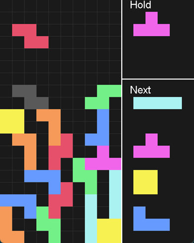

## 概要

sbt を利用して Java と Scala で作成したテトリスゲーム

## 実行方法

`tetris.jar` ファイルを `java -jar tetris.jar` などで実行する。

なお、sbt があれば、`build.sbt` が存在するディレクトリで `sbt clear compile` を実行したのち `sbt tetris/run` で実行可能。

> Scala のバージョンは 2.3.14 です。マイナーバージョンが異なる場合は `build.sbt` の `scalaVersion` を訂正する必要があります。なお、Scala3 では動作しないと思います

やめるときはターミナルから `Ctrl+C` などで kill する。ウィンドウのバツボタンでは完全に停止ができない。

## 操作方法

-   矢印キーでテトリミノの移動
-   Shift キーでホールド
-   左 Ctrl キー、上キーで回転
-   スペースキーでハードドロップ

## クレジット

音楽を以下のサイトよりお借りしています。

-   https://fc.sitefactory.info/
-   https://www.otosozai.com/

## 備考

2022 年作成
